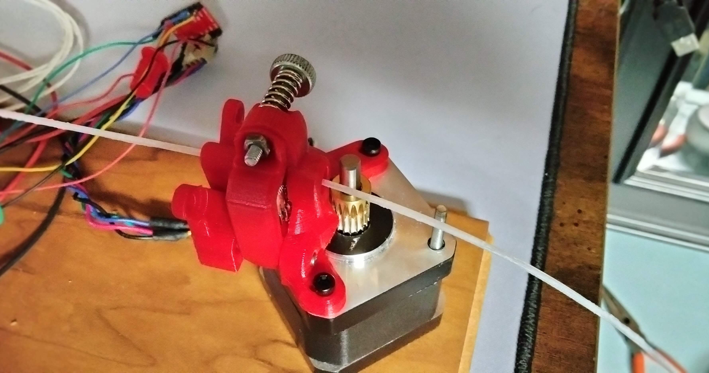

# PETInator
### Firmware for bottle-to-filament machines

[Simulation with stepper motor puller](https://wokwi.com/projects/333363618182595154)

Bottle-to-filament machines are what I call the likes of [Petamentor](https://petamentor.com/) and [The Recreator 3D](http://recreator3d.com/). These machines use hacked PID controllers and PWM motor controllers or 3D printer parts running Marlin. If pultrusion is going to grow, it should be controlled from one board without having to use an entire Marlin interface.

Introducing the PETInator, a full firmware with PID temperature control, stepper or DC motor control, and a lot of room for growth.  Follow the wiring in the demo or using the pinout inside configuration.h. Most changes should be made inside configuration.h, including default stepper speed, default temperature, and pinout. 

## Example setup
Here are a few pictures of what I'm using. It's a jumbled mess of noncommital wiring, but that's because once I'm satisfied with its pulling force, I intend to make the smallest pullstruder you've ever seen. Please forgive the poor photo quality. When I'm happy with the puller V1, I'll take better photos. 

# Features
- Stepper-driven and PWM-motor-driven puller options
- Uncluttered interface (with room for improvement...)
- PID temperature control (with Marlin-like settings, including Thermistor ID)
- Start pulling when temperature reached
- Auto-pause puller when temperature gets too low

# Parts
- Hotend [like this](https://www.aliexpress.us/item/2251832495261371.html)
    - Heatblock (I like the volcano)
    - Nozzles (get the [cheap ones](https://www.aliexpress.us/item/3256802254841948.html))
    - [Silicon Sock](https://www.aliexpress.us/item/3256803120038055.html) or [another kit](https://www.aliexpress.us/item/3256802255638513.html)
    - Heater (12v or 24v, just match your power supply)
    - Thermistor
- Stepper motor - If you can, just upgrade your extruder and steal its stepper. I love the [SuperFly remix](https://www.thingiverse.com/thing:4914090) and [this stepper](https://www.aliexpress.us/item/3256804155557680.html)  
    OR
- [DC Gear Motor](https://www.amazon.com/Fielect-JGB37-500-Micro-Reduction-Engine/dp/B08Y5MJL1J?crid=165S4TL5CYW7&keywords=12v%2B7rpm%2Bdc%2Bmotor&qid=1660206413&sprefix=12v%2B7rpm,aps,167&sr=8-8&th=1&linkCode=sl1&tag=getparts-20&linkId=e1320b5e9f62f1e8d332ea0036dc7b8d&language=en_US&ref_=as_li_ss_tl)
- Stepper Driver, like the [A4988](https://www.aliexpress.us/item/2251832433524521.html). Solder a 47uf or more capacitor across `VMOT` and `GND`. Bigger is fine.  
    OR
- [PWM motor driver](https://www.aliexpress.us/item/2251832828149067.html)
- Arduino [Nano](https://www.aliexpress.us/item/2255800400953393.html) or Uno
- [A Mosfet](https://www.aliexpress.us/item/3256801931155937.html) (solder a 200 ohm or so resistor across R5)
- [1602 LCD with I2C](https://www.aliexpress.us/item/2251832577552289.html)

### Definitely Salvageable
- [3 buttons](https://www.aliexpress.us/item/3256803815119722.html) - or the [bougie choice](https://www.aliexpress.us/item/3256801497578459.html). Wire it like the bottom picture for an always-on LED.
- Power supply - close to [60 watts at 12v](https://www.aliexpress.us/item/2251832856038008.html) or [100 watts 24v](https://www.aliexpress.us/item/3256804001173742.html). Thrift stores are a good bet. 
- Power switch - For a [wired power supply](https://www.aliexpress.us/item/3256803288712514.html) or a [plug-in power supply](https://www.aliexpress.us/item/3256802413254789.html)
- [Power plug](https://www.aliexpress.us/item/3256802728205272.html) or [pre-wired](https://www.aliexpress.us/item/2255800167561413.html) if using a plug-in supply
- Various wires. Salvage from a USB cable if you need. Power wires can be salvaged from the hotend. You don't need more than they provide. 
- [90 degree corner bracket](https://www.aliexpress.us/item/2251832748236574.html). Mine is IKEA!
- A 200 ohm or so resistor for the Mosfet. Go a little higher if needed.
- 47uf or more capacitor for the stepper driver. Bigger is fine.

# Instructions
The most helpful visual is probably this simulation on Wokwi: [Simulation with stepper motor](https://wokwi.com/projects/333363618182595154). Although this uses a stepper motor, you can also use a PWM driven DC motor with the driver connected to the step pin. Just comment out `USES_STEPPER` in `configuration.h` and set `DEFAULT_SPEED` as appropriate.

1. Clone this code into your Arduino directory: `git clone https://github.com/aamott/petinator.git`
2. Open in the Arduino IDE.
3. Edit `configuration.h` according to your needs. If you're using the same layout as in Wokwi, including a non-I2C display, just copy the configuration from there.
4. Wire it up, either by the pinouts listed in `configuration.h` or matching Wokwi.
5. Upload the code to your Arduino (or ESP32).
6. Test and tune the PID values and motor speed as needed and reupload.

# How to Contribute
Check the [Issues](https://github.com/aamott/petinator/issues) tab and look for issues marked with "good first issue". 

When making changes, the try to do the following: 
- Maintain the default Arduino code formatting. If you need to, open the arduino editor and use the auto-format option (Ctrl+T) before committing your changes. 
- Leave comments. The best comment is clear code, but comments are the Rosetta Stone to a budding coder. *Essential* in configuration files. 
- Be somewhat granular in your commits. This is a good practice in general. It makes it easy to back out small changes without losing a lot of work. 
- Upload any photos you find on the discussion tab.